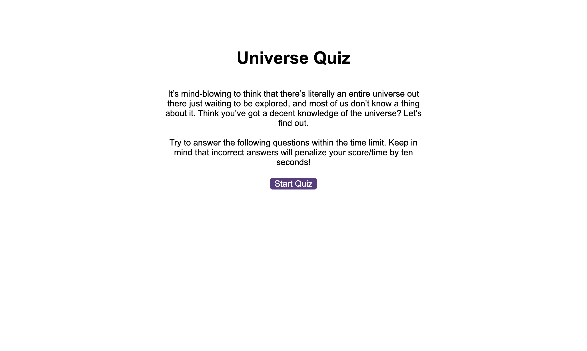

# UNIVERSE QUIZ

## Description

Build a Timed Coding Quiz with multiple-choice questions that will run in the browser, and will feature dynamically updated HTML and CSS powered by JavaScript code.

## Installation
Website:
https://joeviser.github.io/Universe-Quiz/ 

Screenshot Image:

## Usage

The following image shows the web application's appearance:

Create a code quiz that contains the following requirements:

* A start button that when clicked a timer starts and the first question appears.

    * Questions contain buttons for each answer. 
    * When answer is clicked, the next question appears 
    * If the answer clicked was incorrect then subtract time from the clock (10sec)

* The quiz should end when all questions are answered or the timer reaches 0.

     * When the game ends, it should display their score and give the user the ability to save their initials and their score

## Credits

"N/A"

## License

Please refer to the LICENCE in the repo.